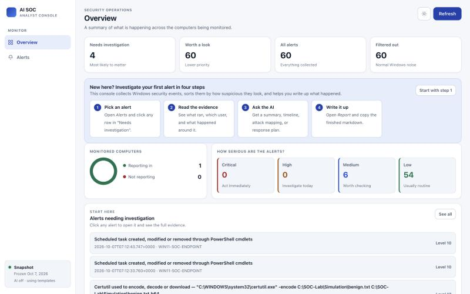
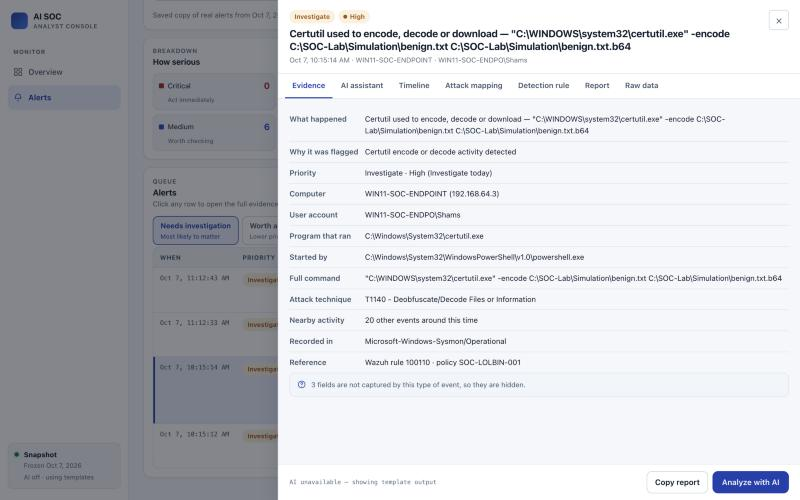

# AI-Powered SOC Investigation Lab

A self-contained security operations lab that runs the full alert lifecycle:
generate attacker-style telemetry on a Windows endpoint, collect it in Wazuh,
triage it, investigate with an LLM-backed analyst assistant, map it to MITRE
ATT&CK, write the detection rule, and publish the incident report.

Built to cover four roles in one project — SOC analyst (investigation),
detection engineer (rule writing), incident responder (documented response),
and threat hunter (proactive searching) — with an AI layer on top.

**▶ [Open the live demo](DEMO_URL_PLACEHOLDER)** — the console running against a
frozen export of real alerts from this lab. No install, no backend. Everything
in it was produced by the pipeline described below.



Clicking any alert opens the full evidence, the ATT&CK mapping, a generated
detection rule, and a report draft:



---

## Architecture

```
Windows 11 ARM VM (UTM)                 macOS host
┌─────────────────────────┐            ┌──────────────────────────────────┐
│ WIN11-SOC-ENDPOINT      │            │ Docker Desktop                   │
│                         │            │  ├── wazuh.manager   (rules)     │
│  Sysmon ────────────┐   │  agent     │  ├── wazuh.indexer   (storage)   │
│  PowerShell logging ┼───┼──1514/15──▶│  └── wazuh.dashboard (Wazuh UI)  │
│  Wazuh agent 001    ┘   │            │                                  │
│                         │            │ AI SOC Console (:5174)           │
│  Invoke-SocLabScenario  │            │  ├── triage policy pack          │
│  .ps1 (6 scenarios)     │            │  ├── Claude investigation layer  │
└─────────────────────────┘            │  └── Sigma / DQL generation      │
                                       └──────────────────────────────────┘
```

Detection and AI are deliberately separate concerns:

| Layer | Job | Where |
| --- | --- | --- |
| Wazuh + Sysmon | Detect activity, raise alerts | `wazuh-docker/` |
| Triage policy pack | Rank alerts, suppress lab noise | `soc-ai-platform/rules/triage-rules.json` |
| Claude assistant | Investigate the selected evidence | `soc-ai-platform/ai.py` |

The AI is **not** the detection engine. It never decides what fires; it reads
what already fired and helps the analyst reason about it. Feeding thousands of
detection rules into a prompt would be the wrong architecture — Wazuh already
ships 3,000+ rules and applies them before the console ever sees an alert.

---

## Repository layout

```
Investigations/     Incident writeups, timelines, MITRE mappings, evidence
Detections/         Sigma rules and Wazuh DQL hunting queries
Simulations/        Self-cleaning Windows attack scenario runner
Endpoint-Config/    Sysmon configuration applied to the monitored endpoint
AI-Layer/           Analyst prompt, case briefs, model output
soc-ai-platform/    The AI SOC console (backend + dashboard)
scripts/            Lab lifecycle, snapshot export, rule validation
```

`wazuh-docker/` is **not committed**. It is an upstream clone, and generating
the indexer certificates writes real private keys into it. Rebuild it with
`./scripts/setup-wazuh.sh`.

---

## Quick start

**Prerequisites:** Docker Desktop, Python 3.10+, and (for telemetry) a Windows
VM running Sysmon and the Wazuh agent.

```bash
git clone REPO_URL_PLACEHOLDER "AI SOC Lab" && cd "AI SOC Lab"
./scripts/setup-wazuh.sh
```

Install the console's optional AI dependency:

```bash
python3 -m venv soc-ai-platform/.venv && soc-ai-platform/.venv/bin/pip install -r soc-ai-platform/requirements.txt
```

Configure credentials:

```bash
cp .env.example .env
```

Then start everything:

```bash
./scripts/start-lab.sh
```

- Wazuh dashboard: `https://localhost`
- AI SOC console: `http://127.0.0.1:5174`

Stop with `./scripts/stop-lab.sh` (preserves data volumes).

---

## The AI layer

The investigation assistant runs a model over the selected alert. The system
prompt is composed from [`AI-Layer/prompts/investigation-summary-prompt.md`](AI-Layer/prompts/investigation-summary-prompt.md),
so the analyst-authored rules — separate fact from hypothesis, name missing
evidence, never assert malice the logs do not support — govern the model
whichever backend serves the request.

Each request sends only the normalized Wazuh alert plus its surrounding events.
Base64 `-EncodedCommand` payloads are decoded server-side first, so the model
reasons about the real command rather than an opaque blob.

### Three backends, one interface

Set `SOC_AI_PROVIDER` in `.env`. The default, `auto`, prefers Claude when a key
exists, falls back to a local Ollama server, then to templates.

| Provider | Cost | Setup | Quality |
| --- | --- | --- | --- |
| `ollama` | Free | `brew install ollama` + `ollama pull llama3.2:3b` | Good summaries; weaker on MITRE precision |
| `claude` | ~5–10¢ per investigation | An API key | Best |
| `template` | Free | None | Deterministic field interpolation, no analysis |

`analyze()` never raises. Every failure — missing SDK, no credential, an
unreachable Ollama server, a request error, or a Claude safety refusal —
degrades to the next option down, and the console labels which one produced the
output. That last case is real here, not theoretical: the evidence contains
genuine attacker-style command lines, so `stop_reason: "refusal"` is handled
explicitly rather than surfacing as an empty panel.

### Running it free and offline

The snapshot decouples the console from Wazuh, which frees the RAM a local model
needs on an 8 GB machine:

```bash
./scripts/stop-lab.sh                 # frees ~5GB
brew services start ollama
cd soc-ai-platform && .venv/bin/python server.py
```

The console serves the frozen export of real alerts and runs analysis locally.
A full investigation takes 20–45 seconds on an M1 and costs nothing.

### Accommodating a small model

Local 3B models needed three specific adjustments, each of which also made the
Claude path better:

1. **Compact evidence.** Small models lose the thread in nested JSON, so they
   get labelled key/value lines instead.
2. **Named techniques, not bare IDs.** Given `T1027` alone, the model invented
   "Living off the Land". It now receives `T1027 - Obfuscated Files or
   Information`.
3. **Task-scoped system prompt.** The analyst prompt specifies a fixed six-section
   summary format. A 3B model obeyed that over the actual instruction and
   returned a summary when asked for a Sigma rule, so the section list is
   dropped for non-summary tasks while the behavioural rules stay.

The detection view also supplies the mechanically-generated Sigma rule for the
model to critique rather than asking it to write YAML from memory — asked to
author one, the 3B model invented schema fields that do not exist in Sigma.
The model does the judgement (what would this miss, what fires falsely); the
generator does the syntax.

## Generating telemetry

[`Simulations/Invoke-SocLabScenario.ps1`](Simulations/Invoke-SocLabScenario.ps1)
runs six safe scenarios from an Administrator PowerShell session in the VM. Each
one cleans up after itself — tasks unregistered, Run values removed, accounts
deleted.

```powershell
Set-ExecutionPolicy -Scope Process Bypass
Z:\Simulations\Invoke-SocLabScenario.ps1 -Scenario EncodedPowerShell
```

| Scenario | Behaviour | ATT&CK |
| --- | --- | --- |
| `EncodedPowerShell` | Base64 `-EncodedCommand` execution | T1059.001, T1027 |
| `DiscoveryBurst` | Rapid local host and account enumeration | T1033, T1082, T1087.001 |
| `ScheduledTask` | Creates then removes a scheduled task | T1053.005 |
| `RunKey` | Writes then removes a `Run` key value | T1547.001 |
| `Certutil` | LOLBin encode of a local marker file | T1140 |
| `TemporaryAdmin` | Creates an account, grants admin, reverts | T1136.001, T1098 |

`-Scenario All` runs every one.

---

## Incidents

| # | Case | Behaviour | ATT&CK | Severity |
| --- | --- | --- | --- | --- |
| [001](Investigations/incident-001-suspicious-powershell/incident-report.md) | Suspicious PowerShell | Nested PowerShell with `-ExecutionPolicy Bypass` | T1059.001 | Level 4 |
| [002](Investigations/incident-002-encoded-powershell/incident-report.md) | Encoded PowerShell | Base64 `-EncodedCommand`, decoded during triage | T1059.001, T1027 | Level 12 |
| [003](Investigations/incident-003-temporary-admin-account/incident-report.md) | Temporary admin account | Account created, elevated, and deleted in 100 ms | T1136.001, T1098, T1070 | Level 12 |
| [004](Investigations/incident-004-pipeline-failures/incident-report.md) | Two silent detection failures | Total telemetry loss, and a false positive ranked top of queue | — (capability gaps) | High |

Incident 003 found that Wazuh's built-in mapping for rule `60154` asserts
`T1484` (Domain Policy Modification) for a *local* group change on a
non-domain-joined host, which is wrong. It also exposed that four of the seven
events had no behavioural triage rule and were falling through to a lab-marker
label. Both are documented and fixed.

Incident 004 is the one worth reading first. It documents two ways this
pipeline was **wrong while reporting itself healthy**: a stale agent address
that caused total loss of endpoint visibility across two days, and a triage
rule that scored routine Windows patching at 98/100 and ranked it above real
detections. Neither raised an error. Both were found only by running a known
attack and noticing the expected alert never arrived.

---

## Detection engineering

Eight Sigma rules in [`Detections/sigma/`](Detections/sigma/), five hunting
queries in [`Detections/wazuh-dql/`](Detections/wazuh-dql/), and five custom
Wazuh rules in [`Detections/wazuh-rules/`](Detections/wazuh-rules/) that are
actually loaded into the SIEM.

That last distinction matters. A Sigma file in a repo is not a detection: it
has to be deployed somewhere that evaluates it. Running every simulation
scenario and checking what fired found three different failure classes:

| Scenario | Failure | Class |
| --- | --- | --- |
| ScheduledTask | Sigma matched `schtasks.exe`; the simulation uses `Register-ScheduledTask` | Rule and simulation could never meet |
| Certutil | Event arrived, no rule fired | Sigma written but never deployed |
| RunKey | No registry telemetry at all | Sysmon default config captures only EID 1 and 5 |

All three are fixed: a proper Sysmon config
([`Endpoint-Config/`](Endpoint-Config/)) unlocks registry, network, file and
DNS telemetry, and the custom Wazuh rules close the detection side.

```bash
./scripts/deploy-wazuh-rules.sh
```

Validate them before committing:

```bash
python3 scripts/validate-detections.py
```

This catches the failure that is otherwise invisible: a Sigma condition
referencing a selection block that does not exist, so the rule parses fine and
never fires. It also enforces a policy-pack invariant — lab-simulation markers
(`soc_lab_temp_admin`, `wazuh-powershell-test`) must score below behavioural
rules, or a genuine privilege-escalation detection gets labelled "SOC lab
scenario" instead of "Member added to local Administrators group".

**On bulk rule import.** Sigma is the right portable source, but Sigma rules do
not become native Wazuh 4.x alerts automatically. Either convert them into
OpenSearch hunting queries with `sigma-cli`, or port the high-value subset into
Wazuh XML under `/var/ossec/etc/rules/`, test with `wazuh-logtest`, and restart
the manager.

---

## Publishing a demo

The console reads from a local Wazuh indexer, which cannot be hosted — putting a
SIEM on the public internet to power a portfolio demo would be reckless. Instead,
freeze a point-in-time export of real alerts:

```bash
python3 scripts/export-snapshot.py --anonymize
```

This writes `soc-ai-platform/sample-data/snapshot.json`. Drop `--anonymize` to
keep the real hostname and username, which is what this repo does — the git
history carries the author's name anyway, so scrubbing one file would hide
nothing.

When the console loads and no backend answers, it serves that snapshot and
labels itself "Snapshot" in the sidebar. Everything still works: the queue,
triage scores, the evidence drawer, surrounding-event timelines, generated
Sigma, and template analysis. Only the live indexer and the model-backed
assistant need a machine behind them.

### Hosting it on GitHub Pages

The console is plain HTML, CSS and JavaScript with no build step, so a static
host serves it directly. Under **Settings → Pages**, publish from the `main`
branch, `/ (root)` folder. The demo is then at:

```
https://<username>.github.io/<repo>/soc-ai-platform/
```

Every asset the page loads is a relative path, and `/api/*` simply 404s, which
is the signal the console already uses to switch into snapshot mode. There is
nothing to configure.

Refresh the demo data whenever the lab has produced something worth showing:

```bash
python3 scripts/export-snapshot.py --minutes 129600 --fetch 7000
git add soc-ai-platform/sample-data/snapshot.json && git commit && git push
```

The wide window matters. The default seven days captures only recent noise;
`--minutes 129600` is 90 days, which reaches back far enough to include the
incidents the writeups refer to. `--fetch` must exceed the number of alerts in
the window, or triage only sees the newest slice and older candidates are
silently dropped.

---

## Security notes

This is a lab, and it is configured like one. Before reusing any of it
elsewhere:

- The Wazuh deployment ships stock credentials (`admin` / `SecretPassword`) and
  a self-signed certificate. The console defaults to the same and disables TLS
  verification against `127.0.0.1`.
- The console binds to `127.0.0.1` only and has no authentication.
- Evidence files contain the real lab hostname, username, and local IP.
- `.env`, `wazuh-docker/`, and all `*.key` / `*-key.pem` files are gitignored.

---

## Verify

```bash
cd soc-ai-platform && .venv/bin/python -m unittest discover -p "test_*.py"
```

```bash
python3 scripts/validate-detections.py
```

```bash
node --check soc-ai-platform/app.js
```
